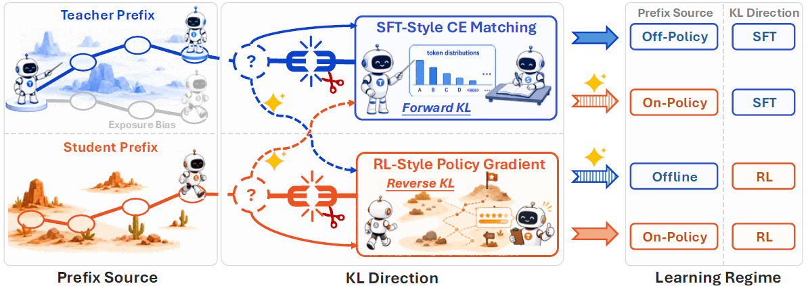
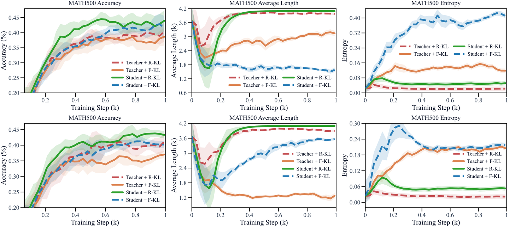
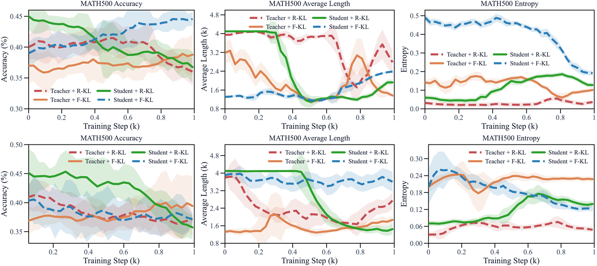
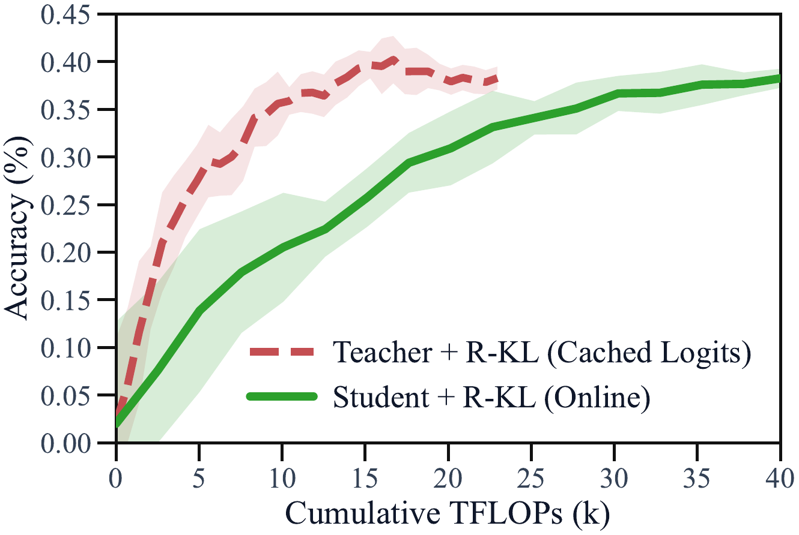
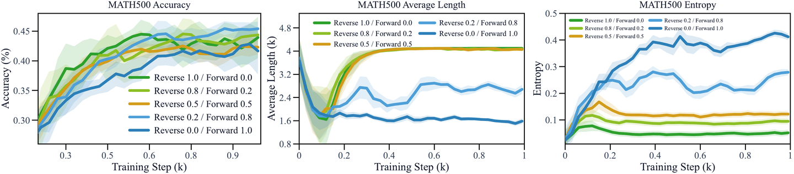
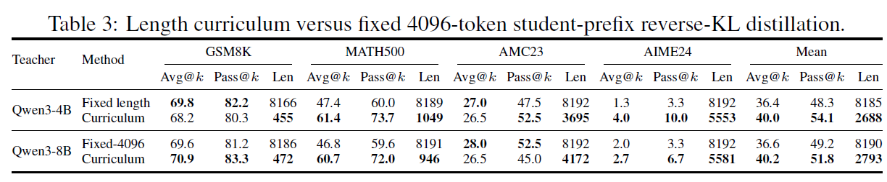

# Decoupling KL and Trajectories (DKLT) 原理与核心解读

**论文**: [Decoupling KL and Trajectories: A Unified Perspective for SFT, DAgger, Offline RL, and OPD in LLM Distillation](https://arxiv.org/abs/2605.16826) | **代码**: [github.com/EIT-NLP/Decoupled-Distill](https://github.com/EIT-NLP/Decoupled-Distill) | **基础模型**: Qwen3

---

## 一、核心思想

### 1. 一个被序列级推导"焊死"的耦合

蒸馏的目标是让学生 $q_\theta$ 的响应分布匹配教师 $p_T$。序列级上有两个选择：

- **Forward KL**: $\text{KL}(p_T \| q_\theta) = \mathbb{E}_{y \sim p_T}[\log p_T(y)/q_\theta(y)]$
- **Reverse KL**: $\text{KL}(q_\theta \| p_T) = \mathbb{E}_{y \sim q_\theta}[\log q_\theta(y)/p_T(y)]$

Forward KL 在教师的响应上取期望，reverse KL 在学生的响应上取期望。利用自回归分解，两个序列级目标分别展开为：

$$
\begin{aligned}
\text{KL}(p_T \| q_\theta) &= \sum_{t=1}^L \mathbb{E}_{s_t \sim d^T_t} \left[ \text{KL}\big(p_T(\cdot|s_t) \,\big\|\, q_\theta(\cdot|s_t)\big) \right] \\
\text{KL}(q_\theta \| p_T) &= \sum_{t=1}^L \mathbb{E}_{s_t \sim d^\theta_t} \left[ \text{KL}\big(q_\theta(\cdot|s_t) \,\big\|\, p_T(\cdot|s_t)\big) \right]
\end{aligned}
$$

其中 $s_t = (x, y_{<t})$ 为 prefix（生成状态），$d^T_t$ 和 $d^\theta_t$ 分别为教师和学生轨迹诱导的 prefix 分布。

**关键洞察**：Forward KL 自动绑定了**教师 prefix**，Reverse KL 自动绑定了**学生 prefix**——"在哪监督"（prefix 来源）和"怎么比较"（KL 方向）这两件事，被序列级推导焊死在了一起。现有实践完全继承了这个绑定：

- Off-policy 蒸馏（R1 等）= 教师轨迹 + token 级 forward KL
- On-policy 蒸馏（OPD）= 学生轨迹 + token 级 reverse KL

**论文核心论点**：这个耦合只是序列级推导的副产品。在 token 级上，这两个维度**完全正交**——prefix 来源和 KL 方向可以独立选择。

### 2. 解耦框架：一张 2×2 表格

做 Cartesian product，得到四个合法目标：

| | Forward KL（SFT 式梯度） | Reverse KL（RL 式梯度） |
|:---:|:---:|:---:|
| **教师 prefix（off-policy）** | **Off-policy SFT** 🏛️ | **离线 RL 式蒸馏** 🏭 |
| **学生 prefix（on-policy）** | **DAgger 式 on-policy SFT** 🚗 | **OPD** 🎯 |

其中两个 off-diagonal 组合（教师 prefix + reverse KL、学生 prefix + forward KL）此前从未被系统研究过。

---

## 二、理论基石：两条梯度恒等式

固定 prefix $s_t$，将教师 $p_T(\cdot|s_t)$ 视为与 $\theta$ 无关的常数。

### Proposition 1 (Token-level KL 梯度)

**(i) Forward KL → SFT 式交叉熵**

$$
\nabla_\theta \text{KL}(p_T \| q_\theta) = -\mathbb{E}_{y \sim p_T(\cdot|s_t)}[\nabla_\theta \log q_\theta(y|s_t)]
$$

这正是以教师分布为 soft target 的交叉熵梯度。在教师采样出的 token 上做单样本 Monte Carlo 近似，就退化为 hard-label SFT。

**(ii) Reverse KL → REINFORCE / Policy Gradient**

$$
\nabla_\theta \text{KL}(q_\theta \| p_T) = \mathbb{E}_{y \sim q_\theta(\cdot|s_t)}\left[(\log q_\theta(y|s_t) - \log p_T(y|s_t)) \nabla_\theta \log q_\theta(y|s_t)\right]
$$

最小化 reverse KL 等价于最大化负 reverse KL，其梯度为 REINFORCE 上升方向：

$$
-\nabla_\theta \text{KL}(q_\theta \| p_T) = \mathbb{E}_{y \sim q_\theta}\left[ \underbrace{(\log p_T(y|s_t) - \log q_\theta(y|s_t))}_{\text{稠密奖励 } r(s_t, y)} \cdot \nabla_\theta \log q_\theta(y|s_t) \right]
$$

每个 token 的**稠密奖励**恰好是师生 log-ratio：

$$
r(s_t, y) = \log p_T(y|s_t) - \log q_\theta(y|s_t)
$$

教师概率比学生高 → 奖励为正，推高该 token；反之为负，压低它。

**KL 方向这一个开关，直接决定了你在做 SFT 还是 RL。**

---

## 三、四个目标的深入解读

### 1. 教师 prefix + Forward KL = Off-policy SFT

在教师轨迹上做交叉熵匹配，即 R1 式蒸馏的精确刻画。教师 prefix 对学生而言是 off-policy 的。

### 2. 学生 prefix + Forward KL = DAgger 式 On-policy SFT

DAgger（Dataset Aggregation）是模仿学习的经典算法，解决 behavior cloning 的 covariate shift 问题。其思路是：让 learner 自己跑，expert 在 learner 实际访问到的状态上给出标注。

对应关系：
- DAgger 的 learner 策略 $\pi_\theta$ ↔ 学生 $q_\theta$
- DAgger 的 expert 策略 $\pi^\star$ ↔ 教师 $p_T$
- DAgger 的 learner 状态分布 $d^{\pi_\theta}$ ↔ 学生 prefix 分布 $d^\theta$
- DAgger 的监督损失 ↔ soft-label cross-entropy / forward KL

### 3. 教师 prefix + Reverse KL = 离线 RL 式蒸馏

离线 RL 设定：数据由行为策略预先采好，目标策略不与环境交互，只在固定数据集上做 RL 式更新。

对应关系：
- 教师 = 行为策略（behavior policy），固定采样 prefix
- 学生 = 目标策略（target policy），在此 prefix 上接受 log-ratio 奖励驱动的 policy gradient 更新
- 数据分布与被优化策略分离 → 离线 RL 的核心结构

### 4. 学生 prefix + Reverse KL = OPD

学生自己 rollout，在自己的状态分布上做 policy gradient，奖励是稠密的师生 log-ratio——OPD 的本质就是 dense-reward on-policy RL。

---

## 四、三大权衡

团队在严格受控的实验台上系统评估了四个目标：Qwen3-4B/8B → Qwen3-0.6B，DeepScaleR 训练，AIME24/AMC23/MATH500/GSM8K 评测。训练全程追踪准确率、响应长度、预测熵三条曲线。

### 权衡 1：KL 方向 —— 精度 vs 熵（Accuracy–Entropy Tradeoff）

| 特性 | Forward KL | Reverse KL |
|:---:|:---:|:---:|
| **Standalone Avg@k** | 较低（基准） | **高 +2.45 pts** |
| **预测熵** | ✅ 保持健康 | ❌ 推向崩塌 |
| **Pass@k** | 稳定 | 长序列下反而更低 |
| **RL 可训练性** | ✅ 稳定爬升 | ❌ 精度回吐 |

**蒸馏阶段的观察**：从上图可以清晰看到四个目标在蒸馏过程中的表现差异。在 **128-token 短序列**设置下（上图），**Student + R-KL（即 OPD）收敛最快，精度最高**，曲线上升最为陡峭，很快拉开与其他三个目标的差距；Teacher + R-KL 次之，两个 forward KL 目标（Teacher + F-KL 和 Student + F-KL）精度相对较低。进入 **4096-token 长序列**设置后（下图），差距进一步放大：Student + R-KL 仍保持在精度上的领先地位，但代价已经清晰可见——其**响应长度曲线急速膨胀**，几乎逼近 4096 的最大生成上限，同时**预测熵急剧下降**，向零崩塌。相比之下，两个 forward KL 目标的长度和熵曲线保持平缓健康，但精度也明显更低。**Teacher + R-KL 则处于中间状态**：精度高于 forward KL 但低于 Student + R-KL，熵崩塌和长度膨胀问题也比 Student + R-KL 略轻。

**RL 阶段的观察**：GRPO 后续训练的曲线揭示了一个与蒸馏阶段截然不同的格局。**128-token warmup 后的 RL 中（上图）**，经过 forward KL warmup 的模型（Student + F-KL 和 Teacher + F-KL）展现出稳定的精度爬升趋势，预测熵保持在较高水平，为 RL 探索提供了充足空间；而 Student + R-KL（蒸馏阶段的精度冠军）进入 RL 后精度近乎停滞，甚至出现**回吐**——起点虽高但被 forward KL 反超。**4096-token warmup 后的 RL 中（下图）**，这种反差更加剧烈：Student + R-KL 的精度曲线不升反降，一路下探，而 Student + F-KL 稳健上升并最终大幅领先。从熵曲线可以清楚看到原因——reverse KL warmup 后的模型在进入 RL 时熵已接近零（长序列下尤其严重），GRPO 的探索机制无从发挥作用；而 forward KL warmup 的模型始终保有较高的预测熵，RL 的迭代优化得以持续。

**关键发现**：Standalone 蒸馏最强的目标（reverse KL），不一定是"蒸馏 + RL"管线的最佳起点。

**原因**：Reverse KL 是 mode-seeking 的，不断集中概率质量到教师高概率的少数 token 上，熵随之崩塌。进入 RL 阶段后，模型缺乏探索空间，精度非但不涨反而回吐。

> "你在蒸馏阶段赢下的每一分，可能都在透支 RL 阶段的探索空间。"

### 权衡 2：Prefix 来源 —— 质量 vs 算力（Quality–Compute Tradeoff）

| 特性 | 教师 prefix | 学生 prefix |
|:---:|:---:|:---:|
| **同等步数精度** | 较低 | ✅ **更高（+1.80 Avg@k, +2.11 Pass@k）** |
| **同等 FLOPs 效率** | ✅ **更高**（可缓存） | 较低（需在线 rollout） |
| **长序列优势** | 较小 | ✅ 更大（+3.55 Avg@k, +2.95 Pass@k） |

学生 prefix 优势的原因：监督发生在学生真正会访问的状态上（DAgger 思想）。但教师 prefix 的轨迹可离线生成、复用，教师 logits 可缓存，算力紧张时反而是更高性价比的选择。

**FLOPs 对比**（以 Qwen3-4B 教师、128-token 为例）：

- 教师 prefix（缓存 logits）：$\approx 23.19$ TFLOPs/step
- 学生 prefix（在线 rollout）：$\approx 83.98$ TFLOPs/step
- 比值：$\approx 3.62\times$

### 权衡 3：训练长度 —— 精度 vs 稳定性（Accuracy–Stability Tradeoff）

| 特性 | 128-token | 4096-token |
|:---:|:---:|:---:|
| **Avg@k** | 较低（基准） | **高 +2.56 pts** |
| **熵 / 长度稳定性** | ✅ 稳定 | ❌ Reverse KL 下熵崩塌 + 长度膨胀 |
| **Forward KL 受益** | — | **更大**（+3.80 Avg@k） |
| **Student prefix 受益** | — | **更大**（+3.55 Avg@k, +2.95 Pass@k） |

---

## 五、两个方法

### 方法 1：KL Mixing

在 token 级加权混合 forward 和 reverse KL：

$$
\mathcal{L}_\lambda(s_t) = \lambda \cdot \text{KL}(q_\theta \| p_T) + (1-\lambda) \cdot \text{KL}(p_T \| q_\theta), \quad \lambda \in [0,1]
$$

**关键发现（不对称性）**：长序列蒸馏必须配**足量的 forward KL 权重**（$\lambda \leq 0.2$，即 forward 权重 $\geq 0.8$），才能在不损失 reverse KL 精度优势的前提下压住熵崩塌和长度膨胀。高 reverse 配比的混合依然不稳。

| 混合配比 ($\lambda$) | 精度 | 熵 | 长度 |
|:---:|:---:|:---:|:---:|
| Pure Reverse ($\lambda=1$) | ✅ 高 | ❌ 崩塌 | ❌ 顶到上限 |
| Forward-heavy ($\lambda=0.2$) | ✅ 几乎持平 | ✅ 健康 | ✅ 稳定 |
| Pure Forward ($\lambda=0$) | ❌ 较低 | ✅ 健康 | ✅ 稳定 |

> **实践启示**：forward KL 在混合中不是配角，而是不可省略的保险。很多团队习惯性地"以 reverse 为主、加一点 forward 调味"，方向恰好反了。

### 方法 2：Entropy-Gated 长度课程

用预测熵实时控制训练长度上限——熵是探索能力的"油表"，油表正常才允许踩油门。

**流程**：
1. 从短训练窗口 $L_0$（如 128 token）起步
2. 持续监控 held-out set 上的预测熵 $H_m$
3. 仅在 $H_m \geq H_{\min}$ 时才放宽长度上限 $L_m \to L_{m+1}$
4. 熵逼近危险区时，长度就地冻结

**效果**

---

## 六、工程实现细节

### Fused Full-Vocabulary KL Kernel

精确的全词表 KL 需要在每个 token 位置物化词表大小的中间张量（$B \times L \times |\mathcal{V}|$），显存压力巨大。

解决方案：实现 fused kernel，将投影、softmax、KL 累加融合成流式的单遍词表扫描，单 token 中间显存从 $O(|\mathcal{V}|)$ 降到 $O(1)$。

### 实验配置

| 超参数 | Standalone 蒸馏 | GRPO 后续 |
|:---:|:---:|:---:|
| 学生 | Qwen3-0.6B-Base | 同左 |
| 教师 | Qwen3-4B/8B-Base | — |
| 学习率 | $5 \times 10^{-7}$ | $10^{-6}$ |
| Batch size | 32 | 32 |
| 训练步数 | 1000 | 1000 |
| 最大长度 | 128 / 4096 | 4096 |
| 计算设备 | 单张 NVIDIA H100 (94GB) | 同左 |
| 训练时间 | ≈16 小时 | ≈14 小时 |

### 与 Schulman's KL Estimators 的关系

Reverse KL 的 log-ratio 奖励 $r_{\text{KL}} = \log p_T - \log q_\theta$ 对应 Schulman 的 $k_1$ 估计器：

| 估计器 | 公式 | 性质 |
|:---:|:---|:---:|
| $k_1$ | $-\log\rho = \log q_\theta - \log p_T = -r_{\text{KL}}$ | 无偏，但单样本可能为负 |
| $k_2$ | $\frac{1}{2}(\log\rho)^2 = \frac{1}{2}r_{\text{KL}}^2$ | 非负，二阶近似 |
| $k_3$ | $\rho - 1 - \log\rho = e^{r_{\text{KL}}} - 1 - r_{\text{KL}}$ | 无偏且非负 |

论文使用 $k_1$（log-ratio reward）形式。

---

## 七、给实践者的速查表

| 你的场景 | 推荐配置 |
|:---|:---|
| **只做蒸馏，不接 RL，追求 Avg@k** | 学生 prefix + reverse KL（即 OPD） |
| **蒸馏后要接 RL** | 保熵优先：forward KL，或高 forward 权重的 KL mixing |
| **算力紧张 / 已有现成教师轨迹** | 教师 prefix，复用轨迹和缓存 logits |
| **要做长序列蒸馏** | KL mixing（足量 forward）+ entropy-gated 长度课程 |

---

## 八、参考资料

- [Decoupling KL and Trajectories (arXiv:2605.16826)](https://arxiv.org/abs/2605.16826)
- [知乎解读：一张 2×2 表格统一 SFT、DAgger、离线 RL、OPD](https://zhuanlan.zhihu.com/p/2049601453162080058)
- [代码仓库：EIT-NLP/Decoupled-Distill](https://github.com/EIT-NLP/Decoupled-Distill)
- [GKD: Generalized Knowledge Distillation](https://huggingface.co/papers/2306.13649)
- [DAgger: A Reduction of Imitation Learning to No-Regret Online Learning](https://proceedings.mlr.press/v15/ross11a.html)
- [On-Policy Distillation (Thinking Machines Lab)](https://thinkingmachines.ai/blog/on-policy-distillation/)
